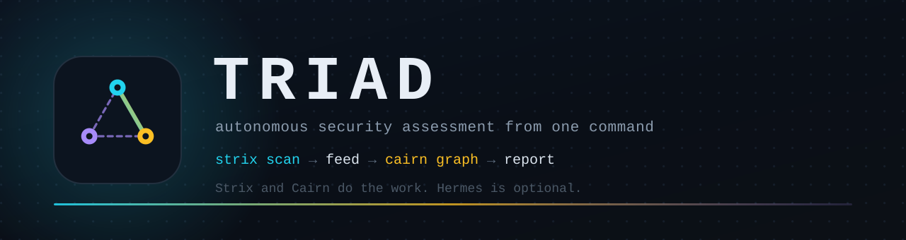

# Triad

Triad runs a Strix scan, moves what it finds into a Cairn graph so Cairn's workers can
exploit it, and writes the report. It is the driver, not another agent: `triad.py`
imports the `plugin/` package directly, and the whole thing works without Hermes.

<p align="center">
  
  
  
</p>

The two layers do different jobs and are kept apart on purpose. [Strix](https://github.com/usestrix/strix)
scans inside a Docker sandbox with no target credentials. [Cairn](https://github.com/oritera/Cairn)
holds the credentials and is the only layer that touches the target, working a
Fact/Intent graph toward a goal you set. Triad hands findings from the first to the
second and stays out of the way.

Reasoning, API notes and failure modes: [ARCHITECTURE.md](ARCHITECTURE.md).

## Install

```bash
git clone https://github.com/squiddyv1/triad.git && cd triad
./install.sh
```

The installer handles its own dependencies, using the command each project publishes:
`uv`, opencode, Docker, Strix and (for the dashboard) the Rust toolchain. It then clones
Cairn, applies the one patch this repo ships, and puts a `triad` wrapper in `~/.local/bin`.
`./install.sh --help` lists the flags, and `--check` reports what is installed without
changing anything. The dashboard builds from Rust by default; `--no-tui` skips it. Hermes
is only installed if you ask for it with `--with-hermes`.

If it added you to the `docker` group, that only applies to new logins: run `newgrp docker`
or log out and back in before going further.

## Quick start

```bash
./install.sh    # the CLI and the dashboard

triad           # open the dashboard; the first run walks setup, then press n for a new scan
triad --status  # the text summary instead, for scripts

triad engage --title ACME --target https://app.example \
             --goal "conclude or rule out every finding in scope" \
             --roe contracts/roe-instructions.md

triad watch  --project proj_001
triad report --project proj_001 --workdir ~/engagements/acme -o report.md
```

`setup` asks once and gives Strix and the Cairn worker the same provider. If they should
differ, because the worker is high-volume and Strix is not, `triad configure` sets them
separately and `triad models` shows what a provider serves, so you do not have to
remember model ids.

## Running an engagement

`triad engage` creates the Cairn project, runs the scan, posts each finding into the
graph as a hint and each actionable one as an intent, then lets the dispatcher work the
leads.

The goal string is the limit of what the run will attempt. A goal that one finding can
satisfy gets you that finding and leaves the rest of the graph alone, so say what you
actually want ("conclude or rule out every module"). `reopen` fixes a completion that was
wrong, but it does not widen a completion that was merely narrow.

`engage` also stops the dispatcher while the scan runs and starts it once the findings
are in, because Cairn will otherwise bootstrap a project that exists before it has any
input. `--no-pause` allows the overlap, `--hold` leaves Cairn paused afterwards, and
`--json` prints a summary for scripts.

The steps are separate commands too, for a scan that is already running or was run
elsewhere: `triad scan`, `triad findings`, `triad feed`. Feeding twice is safe, since
hints and intents are only ever added.

A run can also finish with nothing to hand over. Strix writes a report even when the
assessment never got started, because it ran out of turns or the target blocked it, so a
report on disk is not a finding. `engage` reports what it actually posted and points at
the report, rather than leaving the graph quietly empty.

A headless scan prints nothing while it works, so `triad progress` reads the state Strix
writes as it goes: agents and their status, todos, notes, findings so far, requests and
tokens. `triad progress -f` keeps printing until the run stops, and `triad view` opens
Strix's own dashboard for a live or finished run.

## Commands

| Command | What it does |
|---|---|
| `triad` | open the dashboard; first run walks setup. `--status` / `--no-tui` print the summary |
| `triad setup` | one provider for both layers, written to `.env`, then offers to start |
| `triad configure` | give Strix and the worker different providers or models |
| `triad models` | list what a provider serves |
| `triad up` / `triad down` | start the Cairn server and the dispatcher, or take the stack down |
| `triad status` | list projects, or read one graph with `--project` |
| `triad graph` | one project's nodes, edges and counts (`--json` for the dashboard) |
| `triad cairn-logs` | tail the Cairn log from the live dispatcher, server or container |
| `triad engage` | the whole flow: project, scan, feed |
| `triad scan` / `findings` / `feed` | those same steps on their own |
| `triad progress` | how far along a running scan is, from its own state files |
| `triad view` | open Strix's dashboard for a live or finished run |
| `triad tui` | open the dashboard explicitly (the same app bare `triad` opens) |
| `triad runs` | every run triad knows about, newest first |
| `triad control` | pause, resume, stop or delete a scan or a project |
| `triad watch` / `report` | follow the graph, then write it up |
| `triad auth` | rewrite the worker's credentials from `.env`; `--show` to inspect |

## Dashboard

`triad` (or `triad tui`) opens a terminal dashboard over the same state the CLI reports:
every run with its status, the Strix progress of the selected one (agents, todos, notes,
findings, tokens), the Cairn project it fed into (facts, hints, intents, open work), and
live telemetry for the sandbox container, the scan process and the dispatcher. `triad
--status` prints the text summary instead, and `--no-tui` does the same for scripts.

Keys act on whichever side the footer names as the target. `tab` switches between the run
and its graph, `p` pauses or resumes it, `s` stops it, `d` deletes it after asking, `f`
feeds the run into its project again, `u` starts the stack (`triad up`) and `x` takes it
down after asking. `enter` on the CAIRN target opens the project graph and the Cairn logs.
A scan whose process is gone reads `stale` rather than `running`,
because run.json keeps saying running after a kill.

`n` opens a new-engagement form and starts either a scan or the full engage flow from the
dashboard. `enter` on the STRIX pane opens the selected run's verbose progress: its own
agent message stream first, then agents and todos with status, findings, coverage, usage,
and the tail of `strix.log`. `enter` on the CAIRN target opens the project graph and the
Cairn logs.

The installer builds the Rust dashboard from `tui-rs/` by default, so `triad tui` works
after a fresh install; `--no-tui` skips it. A dashboard build that fails is reported but
does not stop the rest of the install, so the CLI still works without it.

## What is in the repo

```text
install.sh            the installer
triad.py              the driver: setup, configure, engage, watch, report
patches/              the one change this repo makes to Cairn
docker-compose.yaml   Cairn server and dispatcher
dispatch.yaml         worker pool, model routing, concurrency caps
dispatch.local.yaml   no-Docker and arm64 fallback
contracts/            the handoff schema and the rules-of-engagement template
plugin/               the strix_* and cairn_* tools
tui-rs/               the terminal dashboard (Rust)
mcp/cairn_mcp.py      the Cairn graph as an MCP server
assets/               the banner and the mark
```

`plugin/` is a plain Python package. The CLI imports it directly, and when Hermes is
present it loads the same directory as a plugin, so a chat session drives exactly what
the CLI does. Nothing in the normal flow depends on that. `cairn/` appears after install
and is gitignored.

## Known constraints

- Cairn's worker container image is `linux/amd64` only. On arm64, `dispatch.local.yaml`
  runs workers as host processes instead; Strix's sandbox image is multi-arch and runs
  natively.
- Strix's `--max-budget` does nothing on models LiteLLM cannot price. Bound a run with
  `--max-turns`.
- Evidence Cairn writes to `/tmp/cairn-prompts/` does not survive a reboot. Copy what you
  need before closing out.
- The dispatcher is a plain process and does not restart itself. The compose server does.

## Authorization

These are offensive tools. Point them at systems you own, or have written permission to
test within the window that permission covers. Fill in `contracts/roe-instructions.md`
first: it is passed to Strix and posted into the project, and the dry run in
[ARCHITECTURE.md](ARCHITECTURE.md) shows it changing what the scanner does.

## License

MIT, see [LICENSE](LICENSE). Cairn is cloned separately under its own AGPL-3.0, which is
free for personal and educational use and needs a commercial licence otherwise. That is
why it is never vendored here.
